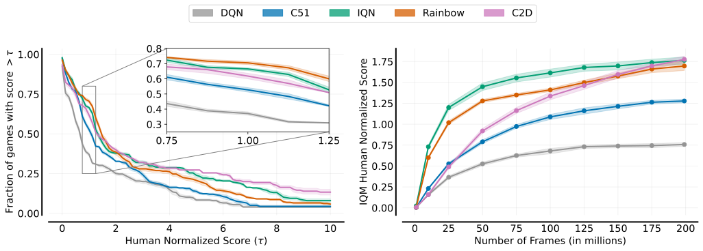
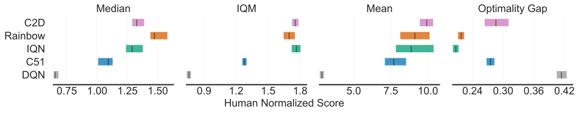
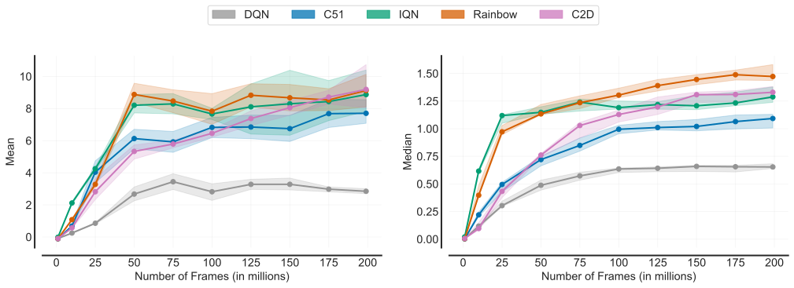
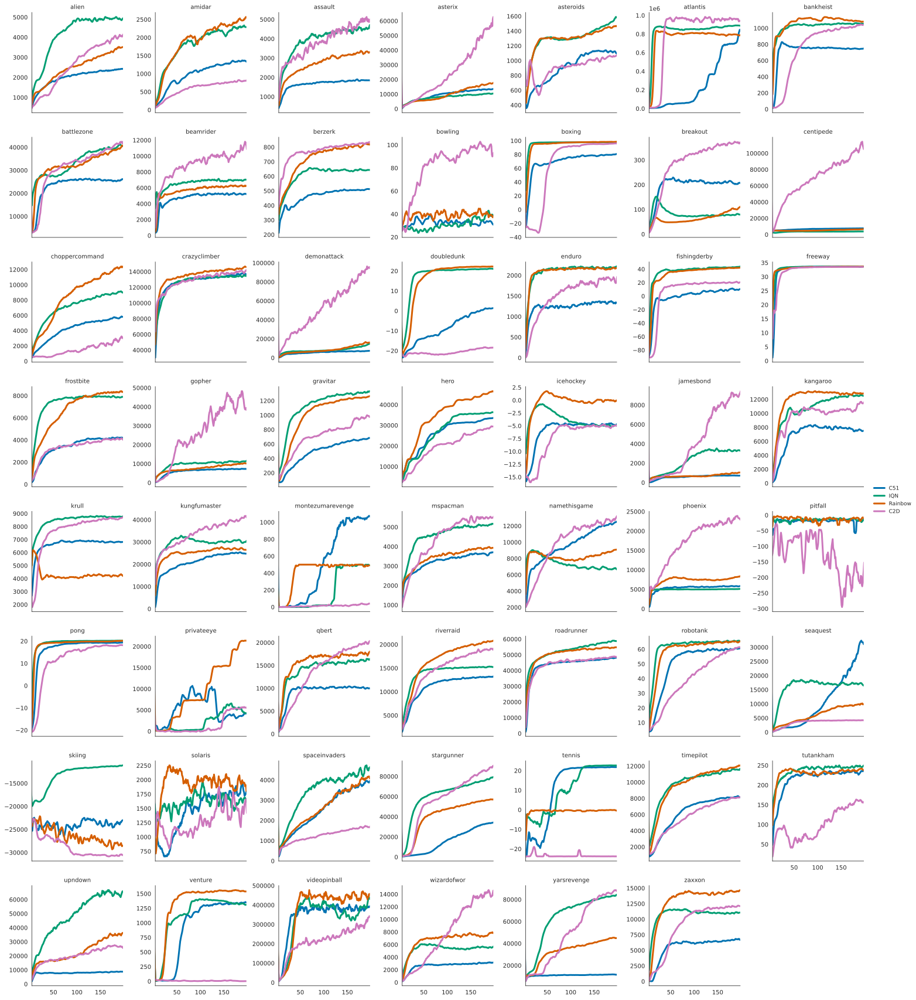
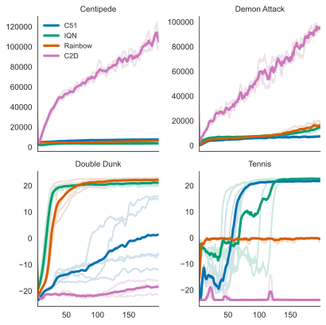
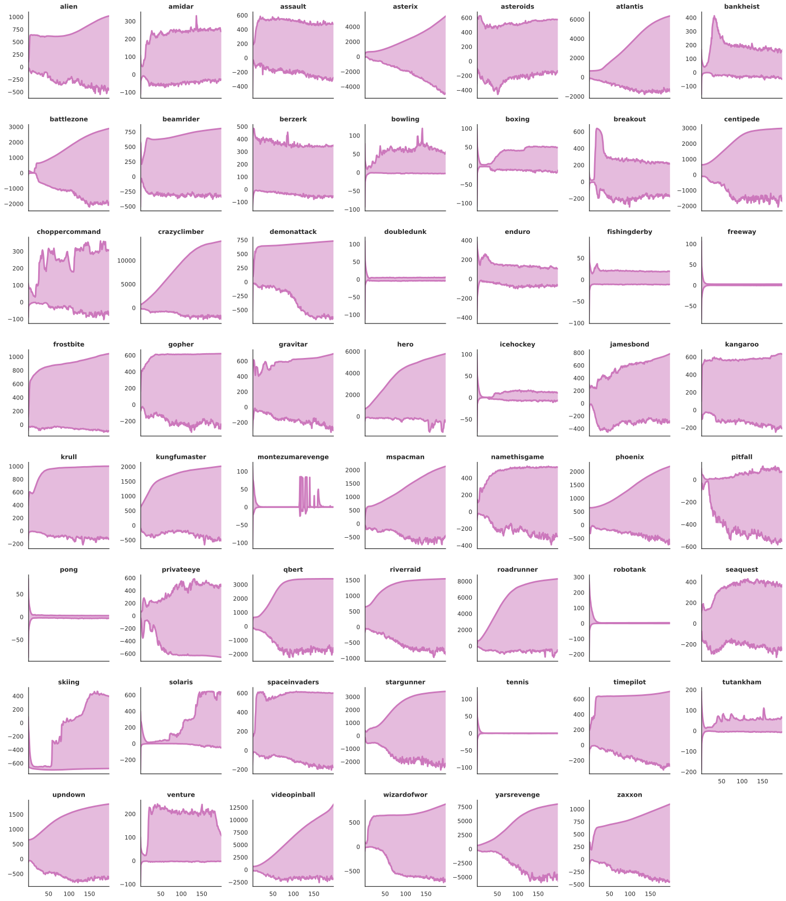

# Conjugated Discrete Distributions for Distributional Reinforcement Learning (C2D)
Code & Data Appendix for *Conjugated Discrete Distributions for Distributional Reinforcement Learning*. 

Björn Lindenberg, Jonas Nordqvist, Karl-Olof Lindahl

## Citation 
If you use C2D in your research we ask you to please cite the following:
```
@misc{lindenberg2021conjugated,
      title={Conjugated Discrete Distributions for Distributional Reinforcement Learning}, 
      author={Björn Lindenberg and Jonas Nordqvist and Karl-Olof Lindahl},
      year={2021},
      eprint={2112.07424},
      archivePrefix={arXiv},
      primaryClass={cs.LG}
}
```

## Data
* Agent scores are available in the [data](data/.) folder. 
* Raw experiment data for each seed is available in the folder [data/supplementary](data/supplementary/). 
* Each seed was run on a VM Ubuntu 20.04 server with 64GB RAM, a single Nvidia Quadro P4000 GPU and TensorFlow 2.5.

## Code
* The C++20 source code that handles ALE and transition buffering resides in [src](src/.).
* The agent code, written in TensorFlow/Python (with algorithms), can be viewed in [c2d](c2d/.).
* Requires cuDNN, TensorFlow 2.X, python3, [The Arcade Learning Environment](https://github.com/mgbellemare/Arcade-Learning-Environment), C++20 and LZ4. For a comprehensive view of dependencies, have a look at our VM setup files in [install_scripts](install_scripts/.).

## Atari Games
* To avoid legal issues, our Atari 2600 rom file directory [ale_roms](ale_roms/.) is left empty. However the corresponding binaries are widely available for import from elsewhere, e.g., *Breakout* or ``breakout.bin`` can be extracted from the ``atari-py`` Python package. 

## Library
* The directory [ale_roms](ale_roms/.) needs to be populated by the relevant binaries of different Atari games. ALE's checksum file ``md5.txt`` for checking binary compatibility is present in the root directory.
* The initial library setup or any changes to [settings.cmake](c2d/.) will require compilation by

    ```
    bash build_lib.sh
    ```
* One can train for one iteration (1M frames) in *Breakout* with:

    ```
    python3 run.py --game breakout --tag test --iterations 1
    ```

# Figures
### Performance Profile (*Deep reinforcement learning at the edge of the statistical precipice*, Agarwal et al. 2021)
 


### Sampling Efficiency: Mean and Median


### Training Graphs


### Strong/Weak Examples
<p align="center">
  
</p> 

### Support Evolution
 

